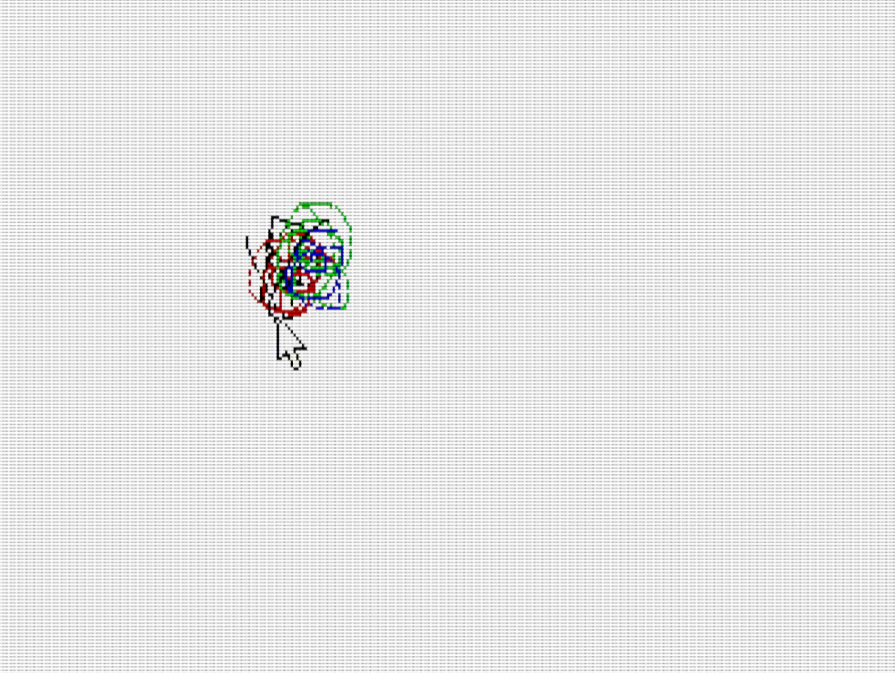
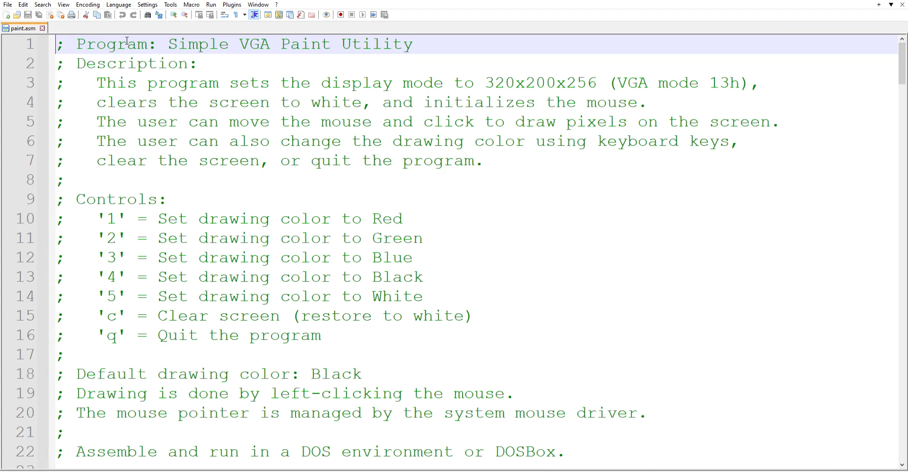

# DOS VGA Paint

## Overview

DOS VGA Paint is a simple paint program developed in assembly language using the A86 assembler. It operates within DOSBox Staging, utilizing VGA mode 13h for graphics. The application allows users to draw on the screen using the mouse and change colors via keyboard inputs.

## Features

- **Simple Drawing Interface**: Draw pixels on the screen with mouse clicks.
- **Color Selection**: Choose from five colors (Red, Green, Blue, Black, White) using keyboard keys.
- **Screen Clearing**: Reset the drawing area to white with a single key press.
- **User-Friendly Controls**: Intuitive keyboard and mouse interactions for an effortless drawing experience.

## Controls

- **'1'**: Set drawing color to Red
- **'2'**: Set drawing color to Green
- **'3'**: Set drawing color to Blue
- **'4'**: Set drawing color to Black
- **'5'**: Set drawing color to White
- **'c'**: Clear screen (restore to white)
- **'q'**: Quit the program
- **Mouse Left-Click**: Draw pixel at cursor position

## Usage

> **Note**: This program was developed using the A86 assembler on DOSBox Staging. Compatibility with other assemblers and environments has not been verified.

1. **Setup**: Ensure DOSBox Staging is installed and properly configured.

2. **Assemble**: Use the A86 assembler to compile `PAINT.ASM`.
   ```bash
   a86 PAINT.ASM
   ```

    > **Note:** Assembling the source code is optional if you prefer to use the precompiled `PAINT.COM` executable.

3. **Run**: Execute the compiled program in DOSBox.
   ```bash
   PAINT.COM
   ```

4. **Interact**: Use the mouse and keyboard controls to draw and change colors as desired.

## Demonstrations

### Program Demo

[](assets/videos/demo.mp4)

[Watch the Demo Video](assets/videos/demo.mp4)

### Code Explanation

[](assets/videos/code_explanation.mp4)

[Watch the Code Explanation Video](assets/videos/code_explanation.mp4)
